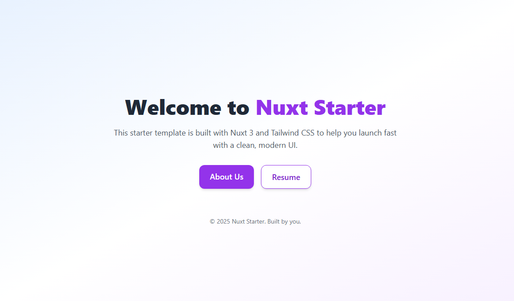

# 🧠 My Dev Portfolio — Nuxt 3 + TailwindCSS

> Full-stack. Mobile. AI. Web3. Desktop. Passion meets code.



## 🔥 Tech Stack

- **Frontend**: [Nuxt 3](https://nuxt.com/), [Vue.js](https://vuejs.org/)
- **UI Framework**: [Tailwind CSS](https://tailwindcss.com/)
- **Deployment**: Static or SSR-ready
- **Built for**:
  - ✨ Personal resume/portfolio
  - 📱 Showcasing mobile & desktop apps
  - 🤖 AI & Machine Learning projects
  - 🌐 Web & Blockchain integrations

---

## 📁 Pages

| Page       | Path        | Description                              |
|------------|-------------|------------------------------------------|
| 🏠 Home     | `/`         | Beautiful intro + link navigation        |
| 👨‍💼 About   | `/about`    | Personal background & bio                |
| 📄 Resume   | `/resume`   | Skills across full stack, AI, and more   |
| 📬 Contact  | `/contact`  | Lightweight resume/contact information   |

---

## 🚀 Getting Started

```bash
### Using npm

# 1. Clone the repo
git clone https://github.com/Temkung007/nuxt-tailwindcss-app-starter.git

# 2. Install dependencies
cd nuxt-tailwindcss-app-starter

# 3. Run the dev server

### Using npm
npm install
npm run dev

### Using bun
bun install
bun run dev
```


